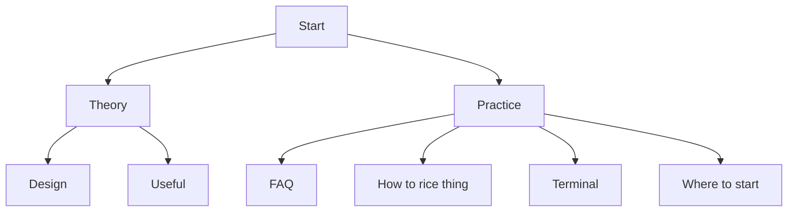

# 🍱 Ricing Guide
Welcome to my little ricing guide, To get started try clicking on any of the following links, All the best and have fun :D
I recommend reading `Where To Start` & the `FAQ`

This guide can also be accessed from [Github Pages](https://nes.is-a.dev/ricing-guide)

## Contributing
If you want to want to contribute (I would be very grateful 🥺) you can do so by simply creating or modifying one of the markdown files in `src/`

## Credits
Most of the following are members of the r/unixporn discord server.

- Animated Wallpaper - Dazai-san#6969
- Picom Animations - nuxsh#9338
- Uniform Look for GTK & QT Apps, QGtkStyle - Gingka#1796 
- Document has been edited by asdadsdafdfdssfd#7660

I have quoted some people here and there and credited them appropriately
