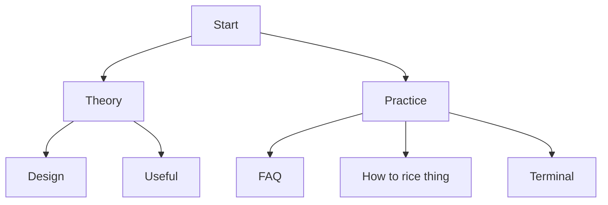

# 🍱 Index

## Credits
Most of the following are members of the r/unixporn discord server.

Animated Wallpaper - Dazai-san#6969
Picom Animations - nuxsh#9338
Uniform Look for GTK & QT Apps, QGtkStyle - Gingka#1796 
Document has been edited by asdadsdafdfdssfd#7660

I have quoted some people here and there and credited them appropriately
