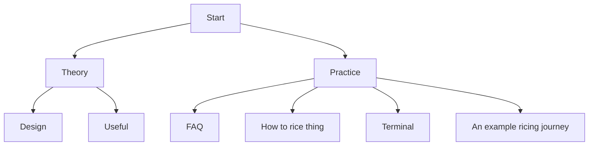

# 🍱 Index

## Credits
Most of the following are members of the r/unixporn discord server.

- Animated Wallpaper - Dazai-san#6969
- Picom Animations - nuxsh#9338
- Uniform Look for GTK & QT Apps, QGtkStyle - Gingka#1796 
- Document has been edited by asdadsdafdfdssfd#7660

I have quoted some people here and there and credited them appropriately

